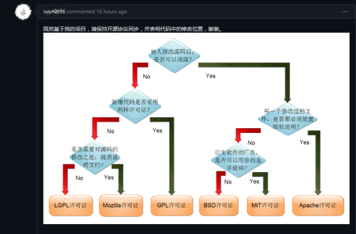
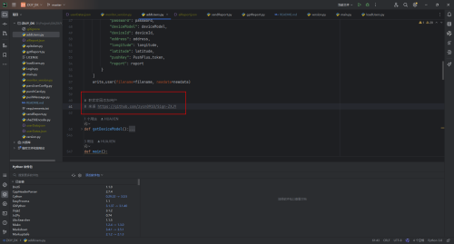

<h1 align="center">ZXJY_DK</h1>
<h3 align="center">职校家园自动打卡</h3>
<h3 align="center">根据岗位自动填写日报内容由ChatGPT 生成</h3>
<h3 align="center">喜欢的话可以点Star ⭐</h3>

<p align="center">
  
  
  
  
  
  
</p>

<p align="center">
  
  
  

</p>

<div align="center">
  <h3>
     <a href="#在线更新">
      在线更新
    </a>
    <span> • </span>
    <a href="#使用教程">
      使用教程
    </a>
    <span> • </span>
    <a href="#更新信息">
      更新信息
    </a>
    <span> • </span>
    <a href="#项目协议">
      项目协议+免责协议
    </a>
    <span> • </span>
    <a href="https://github.com/HUAJIEN/ZXJY_DK/issues">
      提交Bug
    </a>
  </h3>
</div>
<br>

### 鼓励&赞赏  
**请作者喝咖啡，让代码飞一会儿！**
**微信赞赏码！**
<p align="left">
  <a href="https://raw.githubusercontent.com/huajien/ZXJY_DK/master/IMAGES/wx-zanshang.jpg">
   
   
   

</a>
</p>


### **声明：**
此项目由**HUAJIEN**自己个人学习开发使用<br>
开发如有引用其他项目的代码会在代码中声明作者<br>
如引用的 addusers.py<br>
[](https://vip.helloimg.com/images/2023/11/19/owSZlq.md.png)<br>
不要自己给自己带高帽子<br>
不要认为什么项目都是别人copy你的<br>
[](https://vip.helloimg.com/images/2023/11/19/owSR1c.md.png)<br>
已经清空（zy***10）作者adduser.py代码<br>
**不点名了**<br>
职校家园个人分析思路<br>
方法1.使用frida-dexdump进行脱壳<br>
使用frida进行hook<br>
分析frida的源码<br>
使用流量转到电脑bp请求<br>
方法2.使用手机端配置黄鸟算法助手<br>
使用算法助手分析加密算法<br>
使用黄鸟分析请求<br>


### **一个乐子：**
一群人使用代理打卡<br>
不知道是为什么ip会不能打卡<br>
不懂瞎写代码<br>
ZXJY_DK没有代理<br>
因为我知道为什么会打不了卡<br>
😊😊😊😊😊😊😊😊😊😊😊😊<br>
没人强迫你使用本项目<br>
喷我随意此项目仅用来分析app学习<br>

## 在线更新
```bash
git fetch --all && git reset --hard origin/master
```


## 使用教程

一个基于 python的打卡项目。

已支持的平台：

- Windows
- Mac OS
- Linux
- 等平台
- `推荐Linux环境下运行`
- `python >= 3.8`

#### 特点

软件更新自动停止打卡不会出现异常等情况随机延迟<br>
接入gpt自动填写日报周报月报<br>


使用方式
**需要提前下载`Python3`**
1. 下载项目

```bash
cd ~
git clone https://github.huajinet.cf/https://github.com/huajien/ZXJY_DK
```

2. 安装依赖 <br>

```bash
cd ZXJY_DK

pip install -i https://pypi.tuna.tsinghua.edu.cn/simple -r requirements.txt
**如果不行使用**
pip3 install -i https://pypi.tuna.tsinghua.edu.cn/simple -r requirements.txt
```
3. 单独添加用户<br>
```bash
python3 addUsers.py
**tips：可以直接执行main添加用户更加人性化😎**
```

4. 执行单此多用户打卡 <br>
```bash
 python3 main.py
```

### 配置每天定时自动打卡

Linux 下使用推荐使用 `crontab`
Windows 定时任务 不推荐使用（服务器除外）

```bash
crontab -e
最后下面添加

56 7 * * * cd ~/ZXJY_DK && git fetch --all && git reset --hard origin/master && mkdir -p log && python3 main.py >> log/$(date +"\%Y-\%m-\%d").log 2>&1
```


```bash
解释上面crontab


每天早上7点56分，在~/ZXJY_DK目录下执行以下操作：
执行git fetch --all命令，从远程仓库中获取最新的更新。
执行git reset --hard origin/master命令，将本地分支指向与远程origin/master分支相同的位置，并完全覆盖本地分支的内容。
执行mkdir -p log命令，如果不存在log目录则创建一个。
执行python3 main.py >> log/$(date +"\%Y-\%m-\%d").log 2>&1命令，将main.py的输出追加到以当前日期为名称的日志文件中。
```
例子：
```text

    # 每月的最后1天
    0 0 L * * *

    说明：
    Linux
    *    *    *    *    *
    -    -    -    -    -
    |    |    |    |    |
    |    |    |    |    +----- day of week (0 - 7) (Sunday=0 or 7) OR sun,mon,tue,wed,thu,fri,sat
    |    |    |    +---------- month (1 - 12) OR jan,feb,mar,apr ...
    |    |    +--------------- day of month (1 - 31)
    |    +-------------------- hour (0 - 23)
    +------------------------- minute (0 - 59)
```

整体**userData.json**文件结构
```python
  {
    #总开关
    "enabled": True,
    #别名
    "remark": "张三",
   #手机号就是职校家园手机号
    "phone": "18888888888",
    #密码职校家密码
    "password": "admin",
    #手机设备型号
    "deviceModel": "Redmi|22011211C|13",
    #设备id
    "deviceId": "io6tkwgdz2mxcsrv0lupq84a9n51j37fhbye",
    #打卡的位置
    "address": "河南省郑州市郑东新区正光路11号",
    #经纬度
    "longitude": "113.752490",
    "latitude": "34.768420",
    #pushplus的推送key
    "pushKey": "f0fe8fdb8d49490fa6213fc94b9365de",
    #报告开关
    "report": True
  }
```


## 更新信息
###  2024年1月27日更新
- 更新说明文档<br>
- 优化crontab运行前自动更新代码<br>
- **version** 优化版本控制<br>
- **main.py** inputimeout改为30秒 <br>
- **版本升级至0.493**：版本号更新<br>


###  2024年1月17日更新
- 增加微信赞赏码 <br>
- 新增app端 暂时只有打卡功能<br>
- **punchCard.py** 修复打卡使用参数错误 phonetype <br>
- **版本升级至0.492**：版本号更新<br>


###  2024年1月14日更新
- 感谢 [321930869](https://github.com/321930869) 提出问题和解决方案目<br>
- **sendReport.py** 已解决周报开始时间计算逻辑错误<br>
- **版本升级至0.491**：版本号更新<br>


###  2024年1月13日更新
- version.py**调整为1.4.4版本**<br>
- 新版本没有更换东西正常运行<br>
- **版本升级至0.49**：版本号更新<br>


###  2024年1月1日更新
- 新年快乐🎉<br>
- 更新说明文档<br>
- sendReport.py**报告重试次数更新为10次，优化提示词**<br>
- **版本升级至0.48**：版本号更新，日报重试次数更新为10次，月报错误等<br>

###  2023年12月25日更新
- 更新说明文档<br>
- 优化一下gpt问题<br>


###  2023年12月02日更新
- sendReport.py**修复无法日报问题,加入三次ChatGPT重试**<br>
- parsUserConfig.py**减少等待时间**<br>
- **版本升级至0.47**：版本号更新，包含了最新的修复日报错误。<br>


###  2023年12月01日更新
- addUsers.py**文件优化对其**<br>
- gptReport.py**增加ChatGPT请求时间**<br>
- main.py**去除无用的库和代码**<br>
- parsUserConfig.py**去除无用的库添加random和延迟执行代码**<br>
- sendReport.py**重构整个ChatGPT报告转换**<br>
- requirements.txt**添加urllib3将固定固定在1.25版本**<br>
- **版本升级至0.46**：版本号更新，包含了最新的改进。<br>

###  2023年11月24日更新
- 优化crontab 日志信息<br>
- 优化README.md文件更好阅读<br>
- 去除cChardet库<br>

###  2023年11月19日晚更新
- 优化消息推送提示<br>
- 优化登录提示<br>
- 调整用户可以**只打卡或者只写日报周报月报**<br>
- **优化登录提示**<br>
- 修复**main.py**来回调用<br>
- 固定openai版本定在**0.28.0**<br>
- **版本升级至0.45**：版本号更新，包含了最新的改进。<br>
- 暂停几天更新，如有大问题会看情况更新代码<br>

###  2023年11月19日更新
- 清空**（zy***10）**作者adduser.py代码<br>
- 不升级版本号<br>
- 很不爽好自大的**（zy***10）**作者<br>
- 修复其他函数调用main.py报错问题<br>

###  2023年11月18日更新

- **addUsers.py文件优化**：通过简化调用方式，使其更易使用。
- **loadUsers.py文件提示优化**：提高用户友好性。
- **inputimeout库应用**：引入了inputimeout库，实现了超时功能的用户输入处理。
- **版本升级至0.44**：标明版本号升级。

### 2023年11月15日更新

- **addUsers.py文件优化**：对文件进行了调整以提升效率。
- **版本升级至0.43**：版本号更新，包含了最新的改进。
- **README优化**：对README文件进行了更新以提供更好的使用教程。

### 2023年11月14日晚更新

- **addUsers.py文件优化**：对文件进行了调整以提升效率。
- **版本升级至0.42**：版本号更新，包含了最新的改进。
- **README使用教程优化**：进一步优化README文件，使得使用更加方便。

### 2023年11月14日更新

- **请求头优化**：对token请求头进行了优化。
- **问题报告优化**：优化了gpt提问报告问题的处理。
- **版本升级至0.41**：版本号更新，包含了最新的改进。

### 2023年11月12日更新

- **脚本优化**：对脚本进行了一些优化。
- **版本升级至0.4**：版本号更新，包含了最新的改进。
- **Bug修复**：修复了不打卡的bug。

### 2023年11月12日更新

- **日报周报月报内容优化**：内容由岗位使用gpt自动生成。
- **版本升级至0.3**：版本号更新，包含了最新的改进。
- **小问题修复**：修复了一些小问题。

### 2023年11月11日更新

- **适配新版本v.1.4.1**：脚本适配了新的版本v.1.4.1。
- **请求头信息更新**：更新了请求头信息以保持兼容性。
- **版本控制软件加入**：引入了版本控制软件以更好地管理版本。
- **版本升级至0.2**：版本号更新，包含了最新的改进。
- **小bug优化**：优化了一些小bug。

### 2023年11月10日 初版：

- **适配v.1.3.9版本**：脚本适配了v.1.3.9版本。


### 项目协议

本项目基于 [Apache License 2.0](https://github.com/huajien/ZXJY_DK/blob/master/LICENSE) 许可证发行，以下协议是对于 Apache
License 2.0 的补充，如有冲突，以以下协议为准。

1. 使用本项目的过程中可能会产生版权数据，对于这些版权数据，本项目不拥有它们的所有权，为了避免造成侵权，使用者务必在**24小时
   **内清除使用本项目的过程中所产生的版权数据。
2. 本项目内的词语别名为本项目内对项目的一个称呼，不包含恶意，如果项目觉得不妥，可联系邮箱更改或移除。
3. 本项目内使用的部分包括但不限于字体、图片等资源来源于互联网，如果出现侵权可联系本项目移除。
4. 由于使用本项目产生的包括由于本协议或由于使用或无法使用本项目而引起的任何性质的任何直接、间接、特殊、偶然或结果性损害（包括但不限于因商誉损失、停工、计算机故障或故障引起的损害赔偿，或任何及所有其他商业损害或损失）由使用者负责。
5. 本项目完全免费，且开源发布于 GitHub 面向全世界人用作对技术的学习交流，本项目不对项目内的技术可能存在违反当地法律法规的行为作保证，
   **禁止在违反当地法律法规的情况下使用本项目**
   ，对于使用者在明知或不知当地法律法规不允许的情况下使用本项目所造成的任何违法违规行为由使用者承担，本项目不承担由此造成的任何直接、间接、特殊、偶然或结果性责任。

### 免责声明

本项目仅供学习使用，请于下载后24小时内删除项目所有内容。<br>
本项目不对项目内的技术可能存在违反当地法律法规的行为作保证，<br>
**禁止在违反当地法律法规的情况下使用本项目**，<br>
对于使用者在明知或不知当地法律法规不允许的情况下使用本项目所造成的任何违法违规行为由使用者承担，<br>
本项目不承担由此造成的任何直接、间接、特殊、偶然或结果性责任。<br>
拒绝一切使用任何违规方式完成实习和打卡任务。<br>
同时，由于项目的特殊性，可能在任何时间停止更新或删除项目。<br>
若对此有疑问请 mail to: huajien+163.com (请将`+`替换成`@`)<br>
若你使用了本项目，将代表你强者接受以上协议。